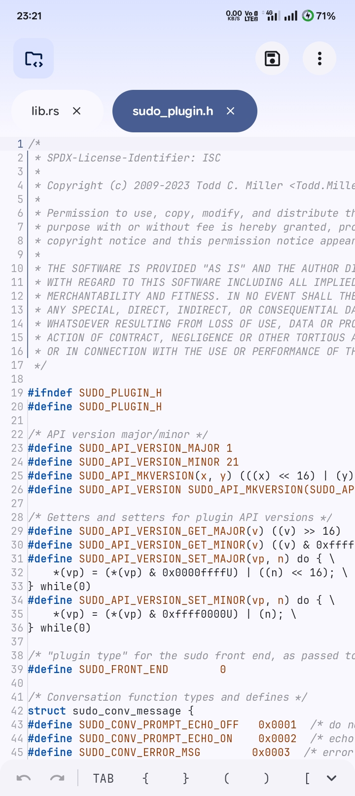
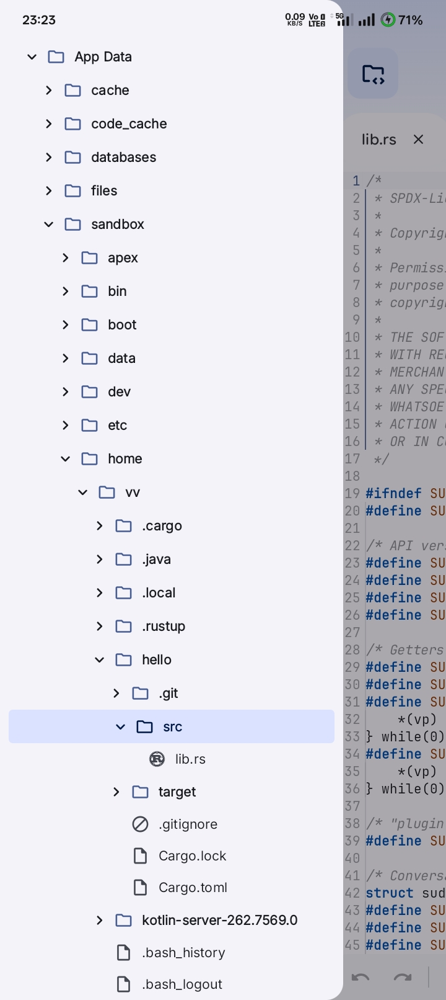
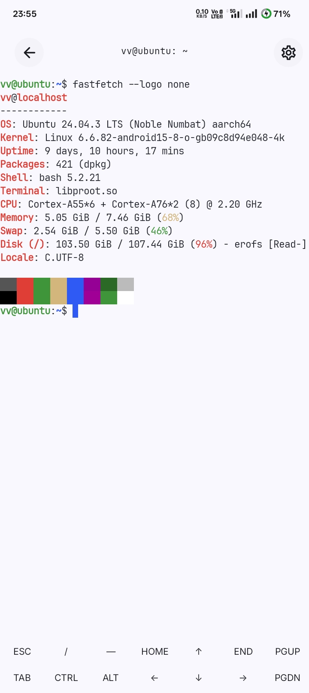

# Zyxn

[](https://github.com/zyxn-dev/zyxn/actions/workflows/ci.yml)
[](LICENSE)
[](https://discord.gg/gTHQTPHNaT)
[](https://t.me/klyx_editor)

Zyxn is a modern code editor for Android built with Jetpack Compose and Material 3 Expressive.

## Screenshots

<p align="center">
  
  
  
</p>

## Download

Download the latest release from the [Releases](https://github.com/zyxn-dev/zyxn/releases/latest) page.

## Building

```bash
git clone --recurse-submodules https://github.com/zyxn-dev/zyxn.git
cd zyxn
./gradlew prepareTreeSitter
./gradlew assembleDebug
```

## Requirements

* Android 9.0 (API 28) or later
* Android Studio Quail or newer
* Android SDK and NDK

## Status

Zyxn is under active development. Features and APIs may change between releases.

## Contributing

Contributions, bug reports, and feature requests are welcome.

* Issues: https://github.com/zyxn-dev/zyxn/issues
* Discussions: https://github.com/zyxn-dev/zyxn/discussions

## License

Licensed under the GNU General Public License v3.0 (GPL-3.0). See [LICENSE](LICENSE) for details.
